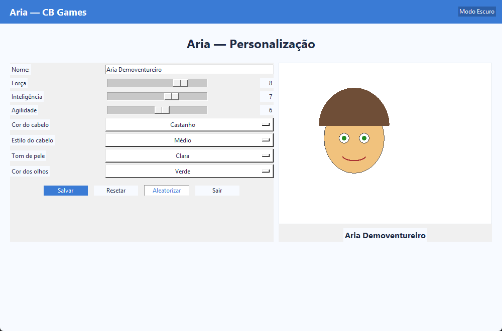

Aria — Guia rápido (Desktop)

O Aria é um app de desktop para criar sua conta, fazer login e personalizar um personagem (atributos de 1–10 e aparência de pele, cabelo e olhos). Tudo é salvo localmente no seu perfil, com segurança.

Veja em 10 segundos
- 

Telas principais
- Login: 
- Cadastro: 
- Personalização: 

Como executar
- Requisitos: Python 3.9+ (Tkinter já incluso)
- Rodar: `python -m Aria.main`

Destaques
- Login e cadastro com validações claras e mensagens objetivas.
- Senhas com hash PBKDF2 + salt (nunca em texto puro).
- Lockout automático após 5 falhas (desbloqueia em 15 min).
- Customização: nome, força, inteligência, agilidade, pele, cabelo (cor/estilo) e olhos.
- Preview em Canvas com nome atualizado em tempo real.
- Tema claro/escuro, tooltips, toasts e atalhos (Ctrl+S, Enter, Esc).

Banco de dados
- SQLite local em `Aria/aria.db` (backup: basta copiar o arquivo).
- Tabelas:
  - `users`: username único, hash de senha, tentativas e bloqueio.
  - `characters`: ficha 1–1 por usuário.

Arquivos úteis
- `Aria/main.py`: janela principal, navegação e tema
- `Aria/database.py`: criação do SQLite, consultas e migração leve
- `Aria/security.py`: PBKDF2 (200k iterações + salt por senha)
- `Aria/ui/*`: telas (login, cadastro, personalização), tema, toast e tooltip

Empacotamento (Windows)
- Executável: `pwsh Aria/build.ps1 -NoConsole` → `dist/Aria.exe`
- ZIP completo: `pwsh Aria/package.ps1`
- ZIP leve (<10 MB): `pwsh Aria/package-lite.ps1`

Licença
- MIT (veja `../LICENSE`).

