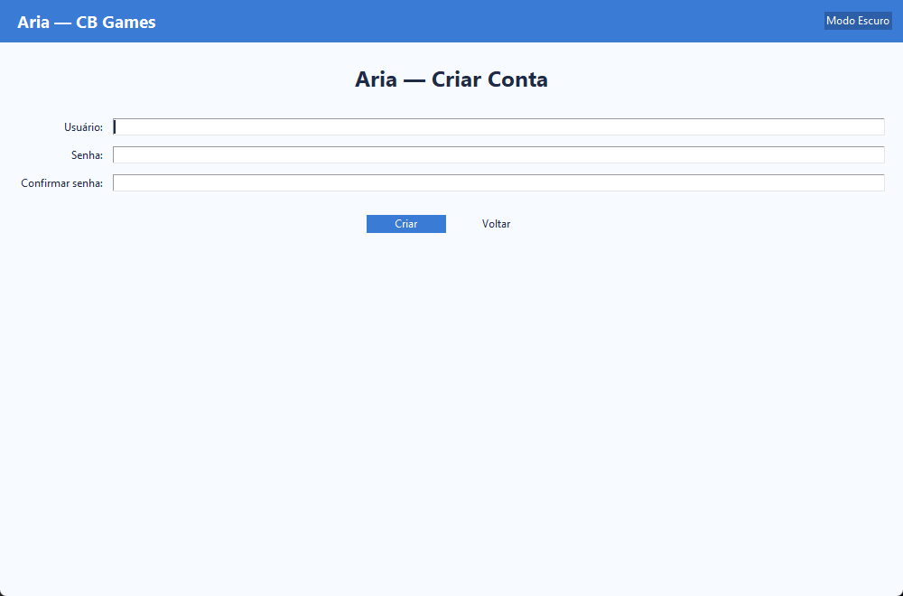

Aria — Crie e personalize seu personagem no desktop

O Aria é um app de desktop simples e focado que permite criar uma conta, fazer login e personalizar o seu personagem com atributos (1–10) e aparência (pele, cabelo, olhos). Tudo fica salvo no seu perfil, localmente, de forma segura. É leve, roda offline e está pronto para ser enviado como executável.

Por dentro do Aria em 12 segundos
- 

Principais telas
- Login: 
- Cadastro: 
- Personalização: 

Destaques
- Login e cadastro com validações claras e mensagens objetivas.
- Senhas com hash PBKDF2 + salt (nunca armazenadas em texto).
- Lockout automático após 5 falhas (desbloqueio em 15 min).
- Customização completa: nome, força, inteligência, agilidade, pele, cabelo (cor/estilo) e olhos.
- Preview em Canvas, com nome atualizado em tempo real.
- Tema claro/escuro, tooltips, toasts e atalhos (Ctrl+S, Enter, Esc).

Baixar o executável (Windows)
- Release v1.0.0: https://github.com/matheussiqueirahub/rpg_game_aria/releases/tag/v1.0.0
- ZIP leve (< 10 MB): link direto para download
  - https://github.com/matheussiqueirahub/rpg_game_aria/releases/download/v1.0.0/Aria_Package_Lite.zip

Rodar pelo código (desenvolvimento)
- Requisitos: Python 3.9+
- Passos:
  - (Opcional) criar venv: `python -m venv .venv && ./.venv/Scripts/Activate.ps1`
  - Executar: `python -m Aria.main`

Como funciona (por cima)
- `Aria/main.py`:1 controla janelas (login/cadastro/personalização), tema e sessão.
- `Aria/database.py`:1 cria e acessa o SQLite local (`Aria/aria.db`) e aplica a migração leve.
- `Aria/security.py`:1 faz hash/verificação de senhas com PBKDF2 (200k iterações + salt).
- `Aria/ui/*`:1 telas e utilitários (tema, toast, tooltip).

Segurança em foco
- Hash PBKDF2 (SHA‑256, 200.000 iterações) com salt aleatório por senha.
- Consultas parametrizadas (evita injeção SQL).
- Lockout: 5 tentativas erradas → bloqueio por 15 minutos.
- Política de senha: mínimo 8 caracteres, com maiúscula, minúscula e número.

Banco de dados
- SQLite local (`Aria/aria.db`), fácil de backup (copie o arquivo).
- Tabelas:
  - `users`: usuário único, hash de senha, tentativas e bloqueio.
  - `characters`: ficha 1–1 por usuário.

Atalhos úteis
- Ctrl+S: salvar personagem
- Enter: submeter (login/cadastro)
- Esc: sair (personalização) / limpar (login) / voltar (cadastro)

Empacotamento
- Build do executável: `pwsh Aria/build.ps1 -NoConsole`
- ZIP completo (código + exe + docs): `pwsh Aria/package.ps1`
- ZIP leve (<10 MB, só exe + README + LICENSE): `pwsh Aria/package-lite.ps1`

Licença
- MIT — veja `LICENSE`:1

Links úteis (Release)
- ZIP completo: https://github.com/matheussiqueirahub/rpg_game_aria/releases/download/v1.0.0/Aria_Package.zip
- ZIP leve (<10 MB): https://github.com/matheussiqueirahub/rpg_game_aria/releases/download/v1.0.0/Aria_Package_Lite.zip
 
FAQ rápido
- Esqueci a senha. Como recupero?
  - As senhas são armazenadas com hash; não é possível recuperar. Crie um novo usuário ou, em ambiente de teste, apague o arquivo do banco (`Aria/aria.db`).
- Minha conta ficou bloqueada. E agora?
  - O bloqueio expira em 15 minutos. Para desbloquear imediatamente em ambiente local, rode no SQLite: `UPDATE users SET failed_attempts=0, locked_until=NULL WHERE username='seu_usuario';`.
- Onde ficam os dados?
  - Em `Aria/aria.db`. Para backup, basta copiar esse arquivo.
- Dá para rodar no macOS/Linux?
  - Sim. Use `python3 -m Aria.main`. Se o Tk não estiver disponível, instale: `sudo apt install python3-tk` (Debian/Ubuntu) ou `brew install tcl-tk` (macOS).

Solução de problemas
- Windows SmartScreen bloqueou o executável
  - Clique em “Mais informações” → “Executar assim mesmo”.
- Erro “tkinter não encontrado”
  - Instale o Tk da sua distro (veja FAQ acima). Em Windows, o instalador oficial do Python já inclui Tk.
- “database is locked” ao abrir múltiplas instâncias
  - Evite abrir mais de uma janela do app sobre o mesmo `aria.db`. Feche as janelas e tente novamente.
- EXE muito grande
  - Use o pacote “Lite” (<10 MB) ou gere localmente com UPX (o build já tenta baixar e usar automaticamente).

Roadmap curto
- Múltiplos personagens por usuário (slots).
- Exportar/importar ficha do personagem (JSON/ZIP).
- Sincronização opcional via MySQL/servidor.
- Testes automatizados (unidade/integrados) e CI.
- Acessibilidade: navegação por teclado e ARIA refinada.

Limitações conhecidas
- SQLite local é adequado para uso single‑user; múltiplas instâncias simultâneas podem bloquear o arquivo.
- Troca de senha/recuperação não está implementada (escopo atual).
